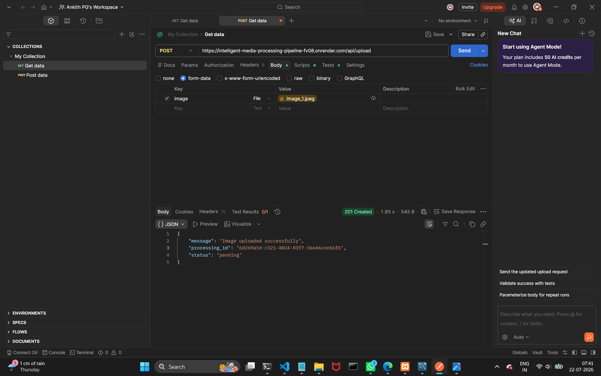
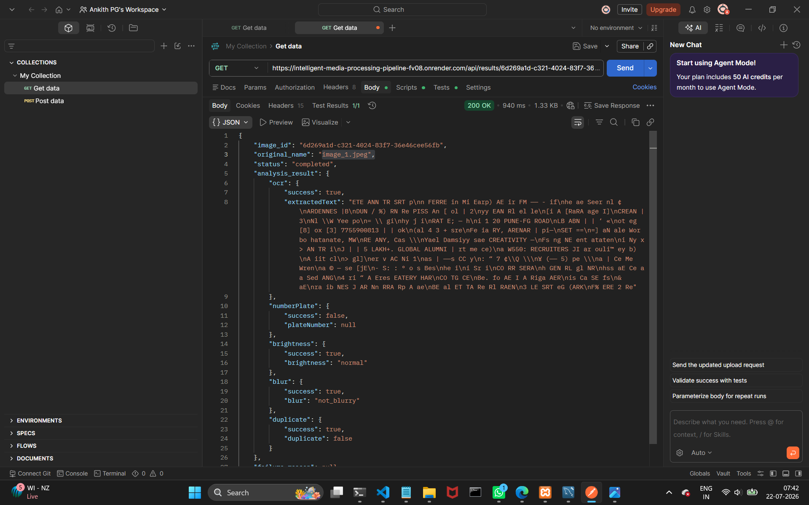
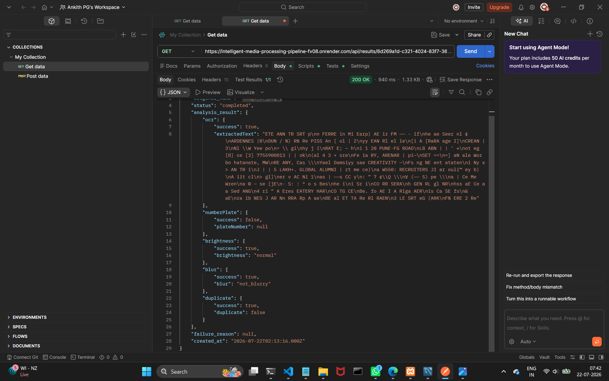
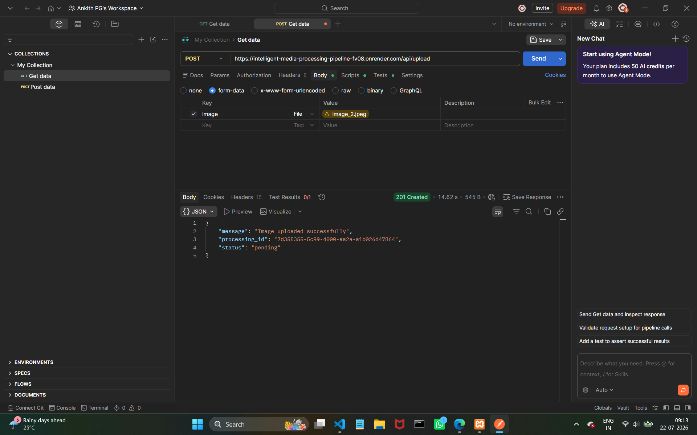
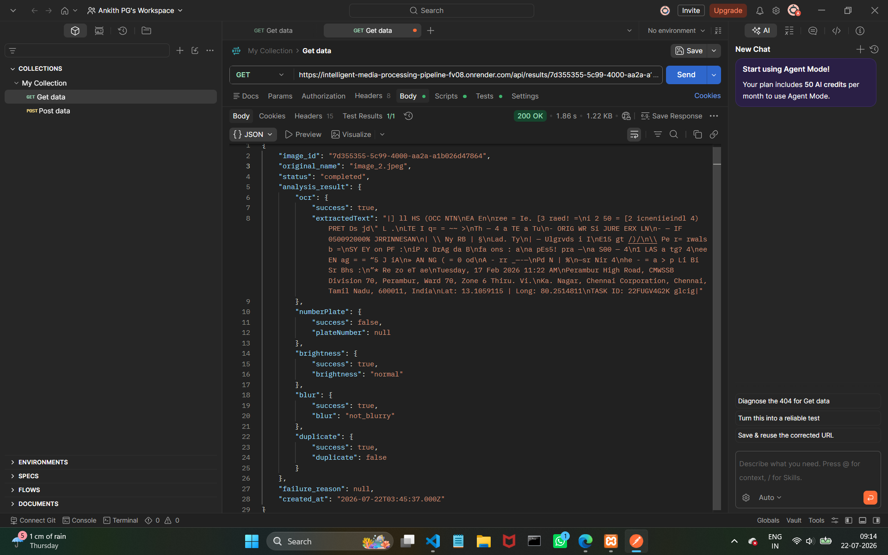
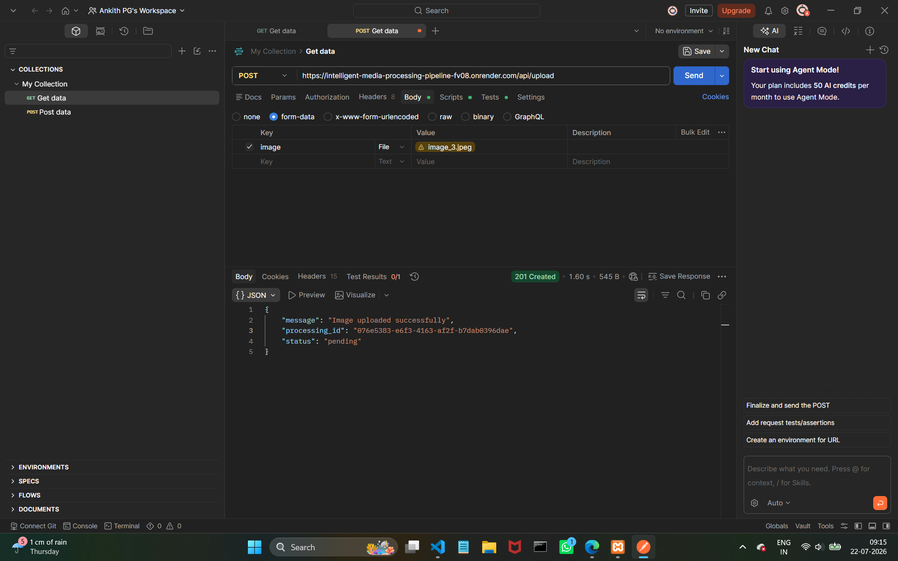
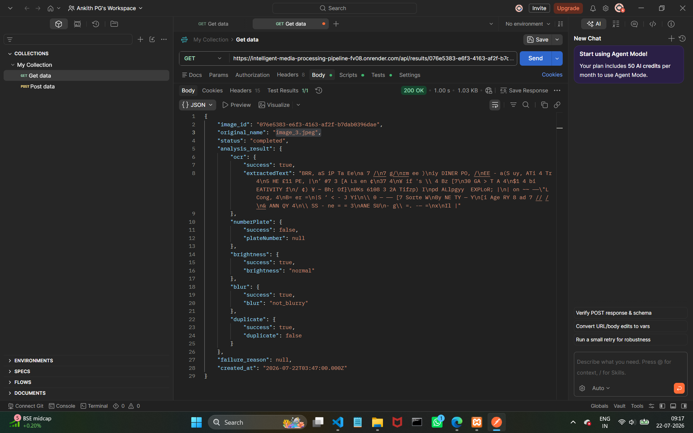

# Intelligent Media Processing Pipeline

## Overview

The Intelligent Media Processing Pipeline is a backend application that accepts uploaded images and processes them asynchronously. The system performs multiple image analysis checks, including blur detection, brightness detection, OCR extraction, number plate validation, and duplicate image detection. Processing results are stored in a MySQL database and can be retrieved through REST APIs.

---
# Live API

[Intelligent Media Processing Pipeline](https://intelligent-media-processing-pipeline-fv08.onrender.com)

---

# Features

- Upload images using REST API
- Generate a unique Processing ID
- Store uploaded images locally
- Store metadata in MySQL (Aiven Cloud)
- Asynchronous background image processing
- Blur Detection
- Brightness Detection
- OCR (Optical Character Recognition)
- Number Plate Check
- Duplicate Image Detection
- Processing Status API
- Analysis Results API
- Cloud Database Integration
- Render Deployment

---

# Tech Stack

## Backend

- Node.js
- Express.js

## Database

- MySQL (Aiven Cloud)

## Image Processing

- Multer
- Tesseract.js

## Deployment

- Render

---

# Project Structure

```text
intelligent-media-processing-pipeline/
│
├── screenshots/
│   ├── image1/
│   │   ├── post-upload.png
│   │   ├── get-result-part1.png
│   │   └── get-result-part2.png
│   │
│   ├── image2/
│   │   ├── post-upload.png
│   │   └── get-result.png
│   │
│   └── image3/
│       ├── post-upload.png
│       └── get-result.png
│
├── src/
│   ├── config/
│   │   ├── db.js
│   │   └── multer.js
│   │
│   ├── controllers/
│   │   ├── uploadController.js
│   │   ├── statusController.js
│   │   └── resultController.js
│   │
│   ├── queue/
│   │   ├── queue.js
│   │   └── worker.js
│   │
│   ├── routes/
│   │   ├── uploadRoutes.js
│   │   ├── statusRoutes.js
│   │   └── resultRoutes.js
│   │
│   ├── services/
│   │   ├── checks/
│   │   │   ├── blurCheck.js
│   │   │   ├── brightnessCheck.js
│   │   │   ├── duplicateCheck.js
│   │   │   ├── numberPlateCheck.js
│   │   │   └── ocrCheck.js
│   │   │
│   │   └── imageProcessor.js
│   │
│   ├── app.js
│   └── server.js
│
├── uploads/
│
├── .gitignore
├── package.json
├── package-lock.json
└── README.md
```

---

# Architecture

```text
                Client
                   │
                   ▼
            Upload Image API
                   │
                   ▼
     Store Image & Metadata in Database
                   │
                   ▼
          Add Job to Background Queue
                   │
                   ▼
                 Worker
                   │
     ┌─────────────┼─────────────┐
     │             │             │
     ▼             ▼             ▼
 Blur Check   Brightness     OCR Extraction
                    │
                    ▼
         Number Plate Check
                    │
                    ▼
        Duplicate Image Check
                    │
                    ▼
      Store Results in MySQL Database
                    │
          ┌─────────┴─────────┐
          ▼                   ▼
    Status API          Results API
```

---

# Service Flow

1. User uploads an image.
2. The server stores the uploaded image.
3. Metadata is stored in the database.
4. A unique Processing ID is returned immediately.
5. The image is added to the background queue.
6. The worker processes the image asynchronously.
7. Image analysis checks are performed.
8. Processing results are stored in MySQL.
9. Users retrieve processing status or final results using REST APIs.

---

# Queue Strategy

The project uses an in-memory background queue for asynchronous image processing.

After an image is uploaded, it is added to the queue instead of being processed immediately. A worker processes queued images independently, ensuring that the Upload API responds quickly without waiting for image analysis to complete.

---

# Major Design Decisions

- Modular project structure for maintainability.
- Separate controllers, routes, services, and queue modules.
- Background processing instead of synchronous execution.
- RESTful API design.
- Cloud-hosted MySQL database (Aiven).
- Independent image analysis modules for better scalability.

---

# Installation

## Clone the Repository

```bash
git clone https://github.com/Ankith2005/intelligent-media-processing-pipeline.git

cd intelligent-media-processing-pipeline
```

---

## Install Dependencies

```bash
npm install
```

---

## Configure Environment Variables

Create a `.env` file in the project root.

```env
PORT=5000

DB_HOST=your_database_host
DB_PORT=your_database_port
DB_USER=your_database_username
DB_PASSWORD=your_database_password
DB_NAME=your_database_name

DB_SSL_CA=your_ssl_certificate
```

---

## Run the Application

```bash
npm start
```

or

```bash
node src/server.js
```

---

# API Endpoints

## Upload Image

**POST**

```
/api/upload
```

### Form Data

```
image : Image File
```

---

## Get Processing Status

**GET**

```
/api/status/:id
```

---

## Get Processing Result

**GET**

```
/api/results/:id
```

---

# Processing Workflow

1. Upload image
2. Store image locally
3. Generate Processing ID
4. Add image to processing queue
5. Perform Blur Detection
6. Perform Brightness Detection
7. Extract text using OCR
8. Validate Number Plate
9. Detect Duplicate Image
10. Store results in MySQL
11. Retrieve processing status
12. Retrieve final analysis results

---

# Sample API Response

```json
{
  "id": 1,
  "status": "completed",
  "blur": false,
  "brightness": "Good",
  "ocrText": "KA01AB1234",
  "numberPlate": {
    "success": true,
    "plateNumber": "KA01AB1234"
  },
  "duplicate": false
}
```

---
# Screenshots

## Test Case 1

### POST /api/upload



### GET /api/results/:id (Part 1)



### GET /api/results/:id (Part 2)



---

## Test Case 2

### POST /api/upload



### GET /api/results/:id



---

## Test Case 3

### POST /api/upload



### GET /api/results/:id


---

# AI Usage Disclosure

AI tools were used during development to:

- Understand image processing concepts.
- Generate initial implementation ideas.
- Improve project structure.
- Resolve JavaScript and Express.js errors.
- Learn OCR integration using Tesseract.js.
- Improve project documentation.

All AI-generated code was reviewed, tested, modified where necessary, and manually validated before being included in the final implementation.

---

# Trade-offs

## Simplifications

- Used an in-memory queue instead of Redis or RabbitMQ.
- Used heuristic-based image analysis instead of machine learning models.
- Stored uploaded images locally instead of cloud object storage.

## Improvements with More Time

- Redis/BullMQ queue implementation
- Docker support
- Automated testing
- Authentication
- Swagger API documentation
- Confidence scoring
- Monitoring dashboard

## Scalability Considerations

- Store images in cloud storage.
- Use distributed background workers.
- Add caching for frequently requested results.
- Support horizontal scaling.

## Failure Handling

- Processing states include pending, processing, completed, and failed.
- Errors are logged.
- Failed processing does not affect other queued jobs.

---

# Assumptions

- Uploaded files are valid image formats.
- Database connectivity is available.
- OCR accuracy depends on image quality.
- Number plate validation is based on pattern matching.
- Duplicate detection uses the implemented comparison logic.

---

# Running Instructions

1. Clone the repository.
2. Install project dependencies.
3. Configure the `.env` file.
4. Start the server.
5. Test the APIs using Postman.
6. Use the Status API and Results API to view processing progress and analysis results.

---

# Future Improvements

- Face Detection
- Object Detection
- QR Code Detection
- Barcode Detection
- Image Classification
- JWT Authentication
- Docker Support
- Swagger Documentation
- Retry Mechanism
- Rate Limiting

---

# Author

**Ankith PG**

GitHub: https://github.com/Ankith2005

---

# License

This project was developed for educational and learning purposes.